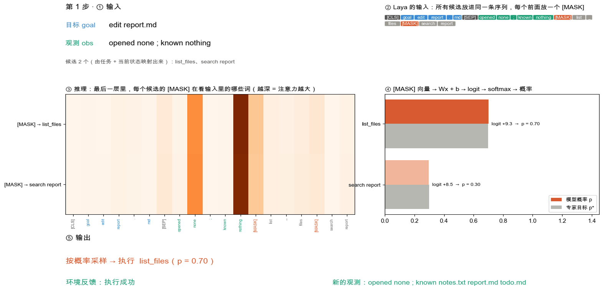
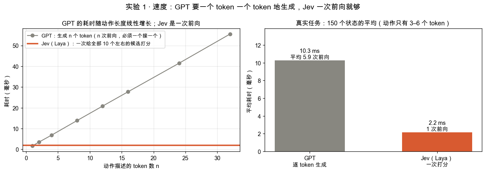
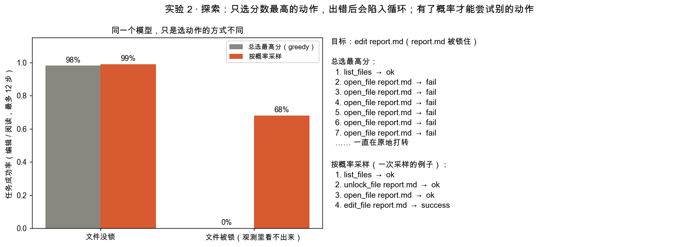
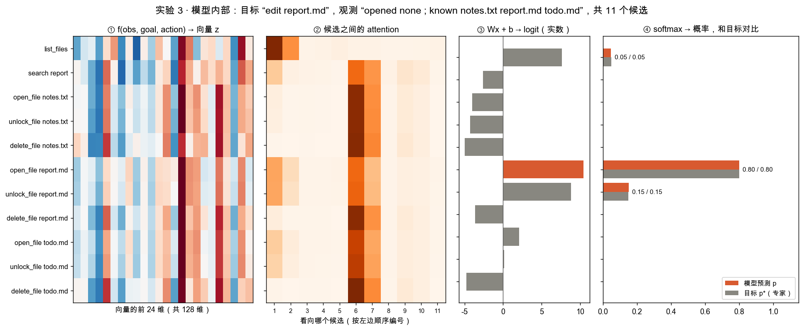
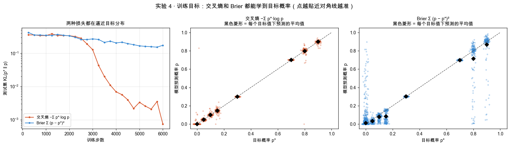
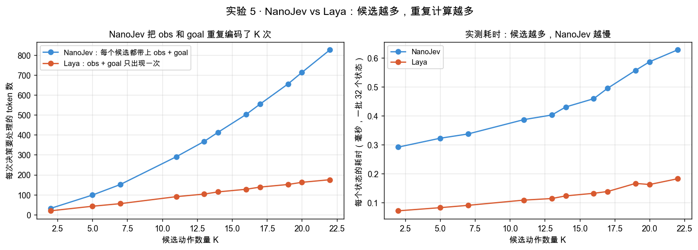
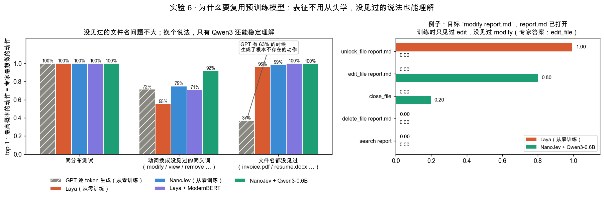

# tiny-jev

[English](README.md) | **中文**

从零实现一个迷你版的 **Jev** 类决策模型，在笔记本上就能训练和运行，用来讲清楚它背后的原理：每一个论点都有一个可以运行的实验来验证。

核心思路：不让大模型逐个 token **生成**动作，而是把每个候选动作**放进输入**，让模型**一次给出所有候选的概率**：

```
f(observation, goal, action_i)  →  向量 z_i  →  logit  →  softmax  →  概率 p_i
```



> 这是一个独立的教学项目。Jev 的内部实现没有公开。**NanoJev** 和 **Laya** 是社区对这类思路的开源实现，本项目的两种结构参照了它们，但它们和本项目都不能等同于 Jev 的真实实现。

## 快速开始

```bash
python3 -m venv .venv && .venv/bin/pip install -r requirements.txt
.venv/bin/python experiments.py      # 6 个实验 → out/*.png（用仓库自带的小模型权重）
.venv/bin/python scenario.py         # 一个完整场景：输入 → 推理 → 输出 → out/scenario.gif
.venv/bin/python animations.py       # 实验的动图版本 → out/gifs/*.gif
```

预训练编码器版本（Qwen3-0.6B / ModernBERT-base）微调后的权重有 270 MB / 600 MB，超过 GitHub 上限，没有放进仓库。重新训练全部模型（Apple Silicon GPU 约 40 分钟，会从 Hugging Face 下载约 2 GB 基座权重）：

```bash
./run_all.sh
```

## 环境：TinyFS

照着视频里 open file / list files 的例子做的迷你“文件系统 agent”任务：

- **状态**：目录里有哪些文件、agent 已经知道了哪些、当前打开的是哪个。有些文件**被锁住**，不先解锁就打不开，而且 agent **看不到**文件有没有被锁
- **目标**：edit / read / delete 某个文件
- **候选**：由“任务 + 当前状态”映射出来（`list_files`、`open_file X`、`unlock_file X`、`edit_file X` ……），每个状态 2 到 22 个
- **目标概率 p\***：规则专家在候选上的分布，比如还不知道目标文件在哪时：`list_files` 0.7、`search` 0.3

## 模型

| 模型 | 是什么 | 参数量 |
|---|---|---|
| `gpt` | 基线：逐个 token 生成动作文本 | 0.7 M |
| `nanojev` | 每个 `(obs, goal, action_i)` 单独编码 → 向量 z_i → 候选之间 attention → logit | 0.7 M |
| `laya` | `[CLS] goal [SEP] obs [MASK] a1 [MASK] a2 …` **一次**双向编码，取每个 `[MASK]` 的向量 | 0.7 M |
| `nanojev_qwen` | NanoJev 结构 + **Qwen3-0.6B**（微调最后 4 层和输出头） | 600 M（训练 67 M） |
| `laya_bert` | Laya 结构 + **ModernBERT-base**（全量微调） | 149 M |

所有 Jev 类模型的输出接口都一样：每个候选一个 logit，在候选上做 softmax。

## 实验结果

下面的数字都来自实际训练和运行本仓库的模型。

| # | 实验 | 结果 |
|---|---|---|
| 1 | **速度**：生成 vs 打分 | GPT 的耗时随动作长度线性增长（32 个 token 要 56 ms）；Jev 一次前向给所有候选打分。真实任务：**10.3 ms vs 2.2 ms** |
| 2 | **探索**：文件被锁 | 同一个模型，总选最高分：成功率 **0%**（一直重复 `open_file`）；按概率采样：**68%**（会试到 `unlock_file`） |
| 3 | **模型内部** | 候选 → 向量 → attention → logit → 概率 **0.80 / 0.15 / 0.05**，和专家的目标概率一致 |
| 4 | **交叉熵 vs Brier** | 两者都能学到目标概率（见校准图）。这里交叉熵收敛更快（测试 KL 0.017 vs 0.159）；预测错得离谱时，Brier 的梯度会变得很小 |
| 5 | **NanoJev vs Laya 的计算量** | 22 个候选时，NanoJev 每次决策要处理 **826 个 token**（每个候选都重复一遍 obs 和 goal），Laya 只要 **175 个** |
| 6 | **为什么要复用预训练模型** | 目标里换成没见过的同义词（modify / view / remove）：从零训练 55–75%，**Qwen3 92%**；ModernBERT 在这一项**没有**帮助（71%）。遇到没见过的文件名，GPT 基线有 **63%** 的时候编出了不存在的动作；Jev 类模型只能从合法候选里选 |
| 7 | **一个完整场景** | `list_files` → `open_file`（失败，被锁住）→ `unlock_file`（以 0.15 的概率采样到）→ `open_file` → `edit_file` ✓ |








## 说明

- 交叉熵和 Brier 都能学习目标概率，概率校准并不必然要求换成 RL。这里把 Brier 当作经典的概率评分方法，不代表它是 Jev 公开的训练配方
- 候选**向量** z、标量 **logit**、softmax 之后的**概率**是三样不同的东西，实验里分别画出
- 实验 7 里每一步的动作都由模型按概率采样；展示的这条轨迹是从多次运行里挑选的，因为它同时包含失败、解锁和成功
- 规模很小，环境是人工构造的。结果用来展示机制，不代表生产环境的数字

## 文件

| 文件 | 内容 |
|---|---|
| `env.py` | TinyFS：状态、候选映射、专家目标概率 p\*、环境动态 |
| `data.py` | 词级词表，NanoJev / Laya / GPT 的数据打包 |
| `models.py` | 五个模型，交叉熵和 Brier 两种损失 |
| `train.py` | 训练，以及在三个测试集上评估（同分布 / 没见过的同义词 / 没见过的文件名） |
| `experiments.py` | 实验 1–6 |
| `scenario.py` | 实验 7：一个完整场景，一步一步可视化 |
| `animations.py` | 动图：速度、探索、训练过程、NanoJev vs Laya 的打包方式 |
